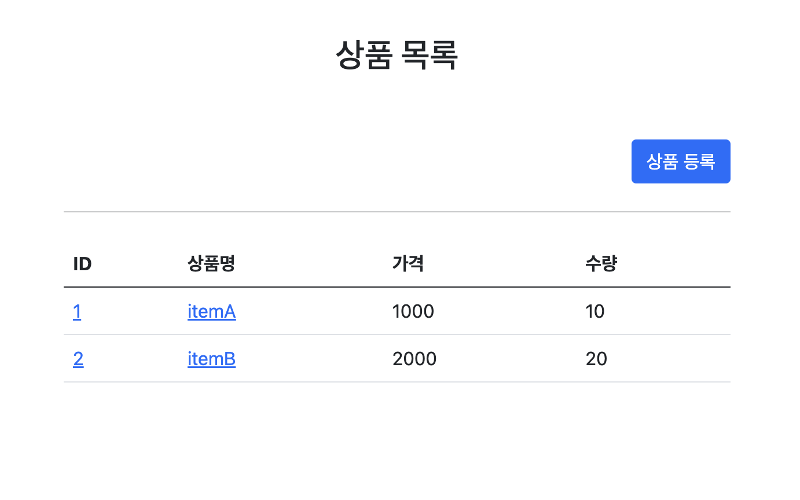
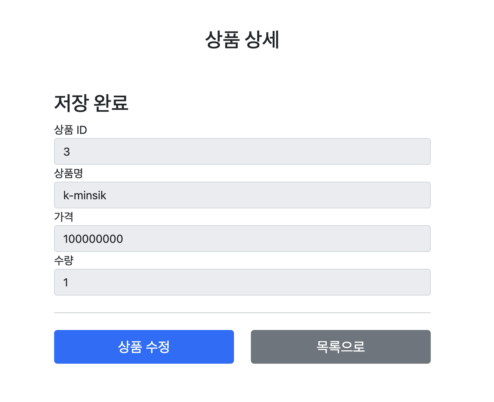
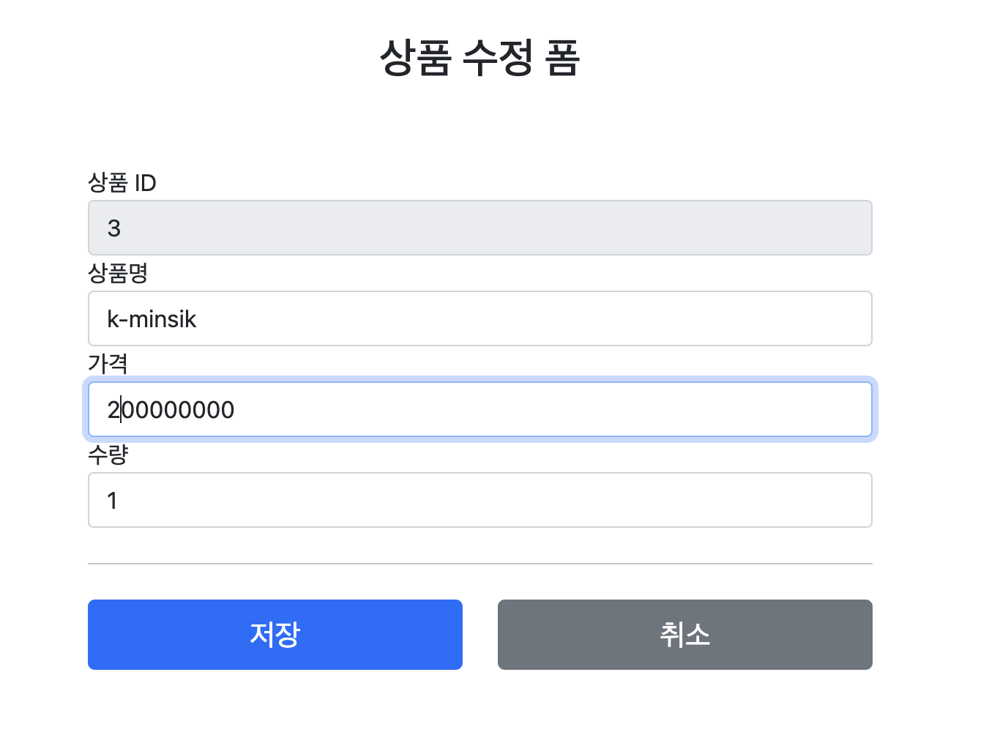
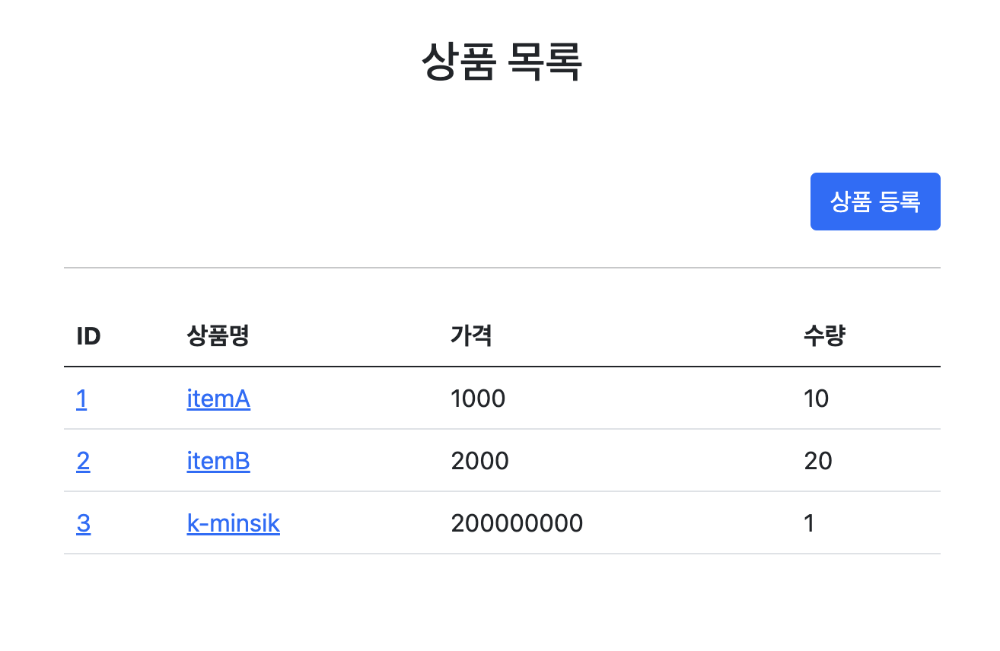

## MVC 웹 페이지 만들기
#### 상품 관리 웹

> 인프런 김영한 강사님 강의수강 목적으로 만들어졌습니다.  
> https://www.inflearn.com/course/%EC%8A%A4%ED%94%84%EB%A7%81-mvc-1/dashboard
---

---

1. 요구사항 분석
   1. 상품 도메인 모델
   2. 상품명

2. 상품목록 - 타임리프

3. 상품 상세
4. 상품 등록 폼
5. 상품 등록 처리
6. 상품 수정
7. PRG
8. RedirectAttributes
